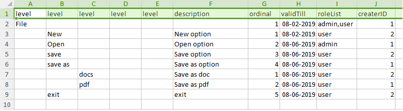

# Excel2JsonTree

 Excel2JsonTree is basically written to easily convert the excel data to json object with dynamic struct binding. It also solves the main problem of converting the excel to nested json object by simply passing struct.

#### Features:

1. Converts excel data into simple json object.
2. Converts excel data into json with nested object.
3. Dynamically typecast Excel cell value to type of struct key. Converts excel data into int, string, float, boolean, slice, struct, slice of struct.  
4. Excel cell value can be directly assign to cell or cell value can be processed and assign to cell.
5. Allows to add custome field values to the struct other than excel fields such as timestamp etc. 

#### Installation:

  ```
  go get github.com/onkarvhanumante/Excel2JsonTree
  ```
  
#### Basic Usage:
(Excel and program could be found in example folder).

**excel file:**



**struct:**
```
type MenuInfo struct {
	ParentName  		string     `json:"parentName"`
	DisplayName 		string     `json:"displayName"`
	MenuDescription     string     `json:"menuDescription"`
	Ordinal     		string     `json:"ordinal"`
	ValidTill   		time.Time  `json:"validTill"`
	RoleList    		[]string   `json:"roleList"`
	HasChild    		bool       `json:"hasChild"`
	MenuList   			[]MenuInfo `json:"menuList"`
	OptionLevel       	int        `json:"optionLevel"`
	CreatedBy			string	   `json:"createdBy"`
}
```

**Step1 : Get variable holder Pointer:**
      
```
variableHolderObjPtr := xlsToJson.GetVariableHolderPtr()
```
variableHolderObjPtr can be used to invoke package built in functions.

**Step2 : Set name of column(s) to be refered for generating json:**

```
variableHolderObjPtr.SetNodesColumnNameMap([]string{"level"})
```
    
  SetNodesColumnNameMap accepts the list of columns name that specifies the level of nodes in excel. In above screenshot **level** is column name that specifies the level of nodes.
  
  **Step3: Map excel header column with struct keys:**
  
  Set header column cell value as map key and struct key as map value.
  
```	
    structXslMap := make(map[string]string)
	structXslMap["level"] = "DisplayName"
	structXslMap["description"] = "MenuDescription"
	structXslMap["ordinal"] = "Ordinal"
	structXslMap["validTill"] = "ValidTill"
	structXslMap["roleList"] = "RoleList"
	structXslMap["createrID"] = "CreatedBy"
```
Pass the structXslMap to SetAttributeMappingMap.

```
variableHolderObjPtr.SetAttributeMappingMap(structXslMap)
```

**Step4: Map the struct key with functions that would process corresponding excel cell value:** 
	
   This steps is optional may depend on what to be implemented.
   
   ***SetKeyFunctionMap*** accepts the struct key and function of type UserDefinedFunction as argument.
   
***SetInputParametersToUserDefinedFunc*** can be used to set input that to UserDefinedFunction function.

```
IdDatabase := make(map[string]string)
IdDatabase["1"] = "user1"
IdDatabase["2"] = "user2"
variableHolderObjPtr.SetInputParametersToUserDefinedFunc("IdDatabase", IdDatabase)
	
variableHolderObjPtr.SetKeyFunctionMap("ValidTill", generateValidTillAttributeValue)
variableHolderObjPtr.SetKeyFunctionMap("ParentName", assignParentName)
variableHolderObjPtr.SetKeyFunctionMap("HasChild", assignCurrentNodeChildStatus)
variableHolderObjPtr.SetKeyFunctionMap("CreatedBy", assignCreatedBy)
variableHolderObjPtr.SetKeyFunctionMap("OptionLevel", assignOptionLevel)
```

Defining ***UserDefinedFunction*** function:

```
var assignCreatedBy xlsToJson.UserDefinedFunction = func(inputMap map[string]interface{}, excelCellValue string, v *xlsToJson.VariableHolder) (interface{}, error) {
	var output interface{}
	idDb := inputMap["IdDatabase"].(map[string]string)
	val, ok := idDb[excelCellValue]
	if ok {
		output = val
	} else {
		return nil, errors.New("Id not present in db")
	}
	return output, nil
}
```

***assignCreatedBy*** function receives 3 argument:

arg1: input set using SetInputParametersToUserDefinedFunc function.

arg2: excel cell value to be processed.

arg3: variable holder instance to call built in public methods - ***GetCurrentNodeLevel(), GetParentNodeForChild(), GetCurrentNode(), GetCurrentNodeChildStatus()*** etc.

**Step5: Assign excel data to struct:**

```
Val, _ := variableHolderObjPtr.ConvertXslToJSON(excelFile.Sheets[0], MenuInfo{}, "MenuList")
```
***ConvertXslToJSON*** returns the Val which can asserted to MenuInfo further.

ConvertXslToJSON accepts the three arguments:
arg1: excel sheet.
arg2: struct to which data need to be assigned.
arg3: struct key in which children nodes would be appended.

**output:**

```
[
    {
        "parentName": "NA",
        "displayName": "File",
        "menuDescription": "",
        "ordinal": "1",
        "validTill": "2019-02-08T00:00:00Z",
        "roleList": [
            "admin",
            "user"
        ],
        "hasChild": true,
        "menuList": [
            {
                "parentName": "File",
                "displayName": "New",
                "menuDescription": "New option",
                "ordinal": "1",
                "validTill": "2019-02-08T00:00:00Z",
                "roleList": [
                    "user"
                ],
                "hasChild": false,
                "menuList": null,
                "optionLevel": 1,
                "createdBy": "user2"
            },
            {
                "parentName": "File",
                "displayName": "Open",
                "menuDescription": "Open option",
                "ordinal": "2",
                "validTill": "2019-06-08T00:00:00Z",
                "roleList": [
                    "admin"
                ],
                "hasChild": false,
                "menuList": null,
                "optionLevel": 1,
                "createdBy": "user1"
            },
            {
                "parentName": "File",
                "displayName": "save",
                "menuDescription": "Save option",
                "ordinal": "3",
                "validTill": "2019-06-08T00:00:00Z",
                "roleList": [
                    "user"
                ],
                "hasChild": false,
                "menuList": null,
                "optionLevel": 1,
                "createdBy": "user2"
            },
            {
                "parentName": "File",
                "displayName": "save as",
                "menuDescription": "Save as option",
                "ordinal": "4",
                "validTill": "2019-06-08T00:00:00Z",
                "roleList": [
                    "user"
                ],
                "hasChild": true,
                "menuList": [
                    {
                        "parentName": "save as",
                        "displayName": "docs",
                        "menuDescription": "Save as doc",
                        "ordinal": "1",
                        "validTill": "2019-06-08T00:00:00Z",
                        "roleList": [
                            "user"
                        ],
                        "hasChild": false,
                        "menuList": null,
                        "optionLevel": 2,
                        "createdBy": "user2"
                    },
                    {
                        "parentName": "save as",
                        "displayName": "pdf",
                        "menuDescription": "Save as pdf",
                        "ordinal": "2",
                        "validTill": "2019-06-08T00:00:00Z",
                        "roleList": [
                            "user"
                        ],
                        "hasChild": false,
                        "menuList": null,
                        "optionLevel": 2,
                        "createdBy": "user1"
                    }
                ],
                "optionLevel": 1,
                "createdBy": "user1"
            },
            {
                "parentName": "File",
                "displayName": "exit",
                "menuDescription": "exit",
                "ordinal": "5",
                "validTill": "2019-06-08T00:00:00Z",
                "roleList": [
                    "user"
                ],
                "hasChild": false,
                "menuList": null,
                "optionLevel": 1,
                "createdBy": "user2"
            }
        ],
        "optionLevel": 0,
        "createdBy": "user1"
    }
]
```

#### Built-in functions:
1. GetVariableHolderPtr() : 

     Returns the VariableHolder instance pointer that can be used to Invoke built in package   function.

2. SetNodesColumnNameMap(list []string):


     Accepts the list of columns name that specifies the level of nodes in excel.

3. SetAttributeMappingMap(structXslMap map[string]string):

   Accepts map that maps the excel header row with struct key.

4. SetKeyFunctionMap(structKey string, functionVariable UserDefinedFunction):
      Maps the struct key with the function of type UserDefinedFunction
      

5. SetInputParametersToUserDefinedFunc(key string, value interface{}):

   Used to set input that can be accessed in UserDefinedFunction.

6. ConvertXslToJSON(sheet \*xlsx.Sheet, structReference interface{}, childrenArrayKey string):

    Assigns excel data to struct. Accepts three arguments I.e sheet, structReference (struct in which excel data to be attached) and    childrenArrayKey (struct key in which children nodes would be appended).

7. SetListStringSeperator(seperator string):

   Sets the separator used to split the string while converting cell data to slice. By default assumes comma(,) as separator.

8. SetExcelHeaderRowIndexNo(indexNo int):

   Sets the row index to be referred for accessing excel header row. By default assumes 0 as index forexcel header row.   

9. GetParentNodeForChild():

   Returns the parent node for current child node.


10. GetCurrentNodeLevel():

    Return current node level.

11. GetCurrentNode():

    Return current node.

12. GetCurrentNodeChildrenStatus():

    Return status whether current node has child or not.

# Contributors:

**Onkar Hanumante** : www.linkedin.com/in/onkar-hanumante

**Suvarna Rokade** : https://www.linkedin.com/in/suvarna-rokade-b469aa125/
